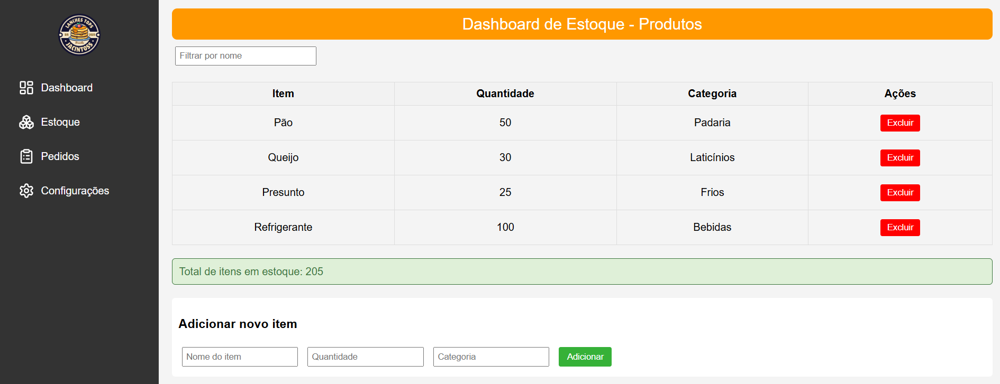

# 📦 Sistema de Estoque para Lanchonete 🥪🍹
<div align="center">


</div>
Sistema completo para <strong>gestão de estoque de uma lanchonete</strong>, com painel visual moderno, backend robusto em <strong>Node.js + PostgreSQL</strong>, e funcionalidades essenciais para controle de produtos.

---

## 🌟 Funcionalidades Principais

| Funcionalidade               | Status | Descrição                                  |
|------------------------------|--------|--------------------------------------------|
| Listagem de produtos          | ✅     | Visualização completa do estoque           |
| Adição de novos itens         | ✅     | Nome, quantidade e categoria               |
| Exclusão de produtos          | ✅     | Remoção segura com confirmação             |
| Filtro em tempo real          | ✅     | Busca instantânea por nome                 |
| Resumo total de itens         | ✅     | Contagem automática                        |
| Registro automático de ações  | ✅     | Via triggers no PostgreSQL                 |
| Painel visual moderno         | ✅     | Com Lucide Icons                           |
| Páginas separadas             | ✅     | Dashboard, Pedidos e Configurações         |

---

## 🛠️ Stack Tecnológica

### Frontend


### Backend


### Banco de Dados


### UI/UX


---

## 📁 Estrutura do Projeto

```bash
simple-stock-system/
├── database/
│   └── lanchonete_db.sql       # Script completo do PostgreSQL
├── js/
│   ├── cadastro-estoque.js     # Lógica do estoque
│   ├── configuracoes.js        # Configurações do sistema
│   ├── dashboard.js            # Dashboard principal
│   ├── pedidos.js              # Gestão de pedidos
│   ├── perfil.js               # Gestão do perfil
│   ├── login.js                # Gestão do usuario
│   ├── theme.js                # Logica dos temas
│   └── server.js               # Servidor Express
├── public/
│   ├── configuracoes.html      # Página de configurações
│   ├── dashboard.html          # Dashboard principal
│   ├── estoque.html            # Dashboard de estoque dos produtos
│   ├── perfil-usuario.html     # Pagina do usuario
│   └── pedidos.html            # Página de pedidos
├── route/
│   ├── pedidos.js              # API de pedidos
│   └── usuario.js              # Rotas de usuário (WIP)
├── src/
│   ├── logo.png                # Logo da lanchonete
│   └── sistema-example.png     # Screenshot do sistema
├── style/
│   ├── dashboard.css           # Estilo da dashboard
│   ├── pedidos.css             # Estilo de pedidos
│   ├── style.css               # Estilos globais
│   ├── configuracoes.css       # Estilos de configurações
│   ├── perfil.css              # Estilos do perfil
│   ├── theme.css               # Estilos para alterar tema (LIGHT/DARK)
│   └── login.css               # Estilo da Index
├── index.html                  # Página inicial
└── README.md                   # Documentação

```

## 🚀 Instalação e Execução

### 1️⃣ Clone o repositório
```bash
git clone https://github.com/YanFellippe/simple-stock-system.git
cd simple-stock-system
```

## 2️⃣ Instale as dependências
```bash
npm install

npm install pg

```

## 3️⃣ Configure o banco de dados
Crie um banco MySQL com o nome lanchonete_db.

Execute o script SQL:
```bash
CREATE DATABASE lanchonete_db;
\c lanchonete_db;

CREATE TABLE produtos (
  id SERIAL PRIMARY KEY,
  nome VARCHAR(100) NOT NULL,
  quantidade INT NOT NULL,
  categoria VARCHAR(50) NOT NULL
);

CREATE TABLE logs_estoque (
  id SERIAL PRIMARY KEY,
  produto_id INT NOT NULL,
  acao TEXT NOT NULL CHECK (acao IN ('adicionado', 'removido', 'atualizado')),
  quantidade INT NOT NULL,
  data_hora TIMESTAMP DEFAULT CURRENT_TIMESTAMP,
  FOREIGN KEY (produto_id) REFERENCES produtos(id)
);

-- Trigger para registrar automaticamente as ações
-- Consulte o arquivo SQL para detalhes completos

-- Dados de exemplo
INSERT INTO produtos (nome, quantidade, categoria) VALUES
('Pão', 50, 'Padaria'),
('Queijo', 30, 'Laticínios'),
('Refrigerante', 100, 'Bebidas');
```

## 4️⃣ Configure a conexão PostgreeSQL no server.js
```bash
const { Pool } = require('pg');

const pool = new Pool({
  user: 'postgres',
  host: 'localhost',
  database: 'lanchonete_db',
  password: 'SUA_SENHA_AQUI',
  port: 5432,
});

```

## 5️⃣ Inicie o servidor
```bash
node server.js
```

## 6️⃣ Acesse no navegador
```bash
http://localhost:3000
```

### 🖼️ Preview


### 🛠️ Funcionalidades futuras

- 🔵 Login e autenticação de usuários
- 🔵 Histórico detalhado de alterações
- 🔵 Upload de imagem por produto
- 🔵 Edição inline dos campos
- 🔵 Dashboard com gráficos (por categoria, movimentações)


### 👨‍💻 Desenvolvedor
<p>Feito com 💻 por Yan Fellippe — Desenvolvedor Fullstack</p>
<p>Sinta-se à vontade para sugerir melhorias ou abrir issues! 🚀</p>
